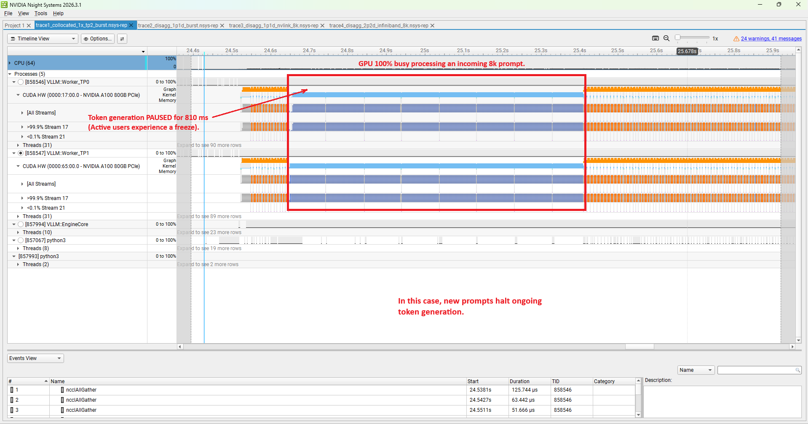
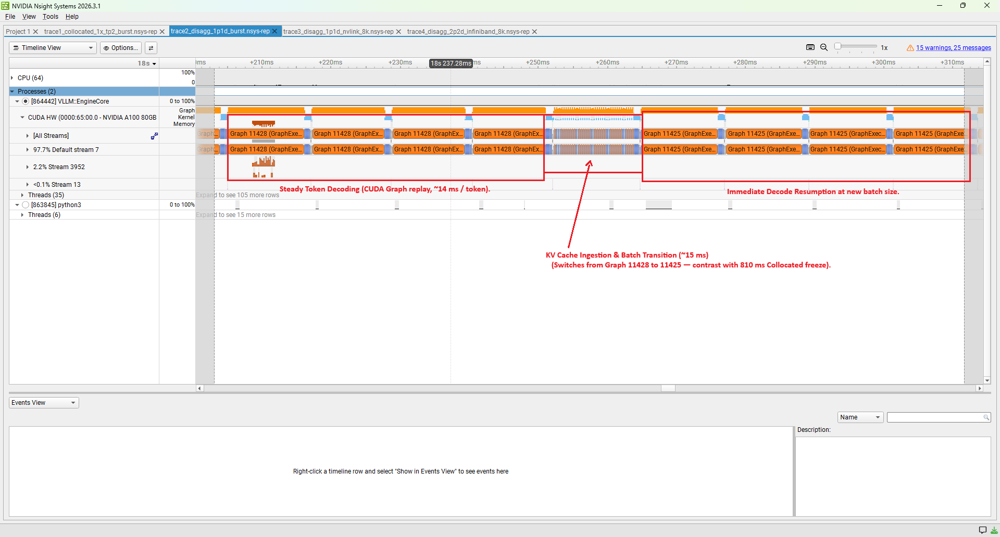
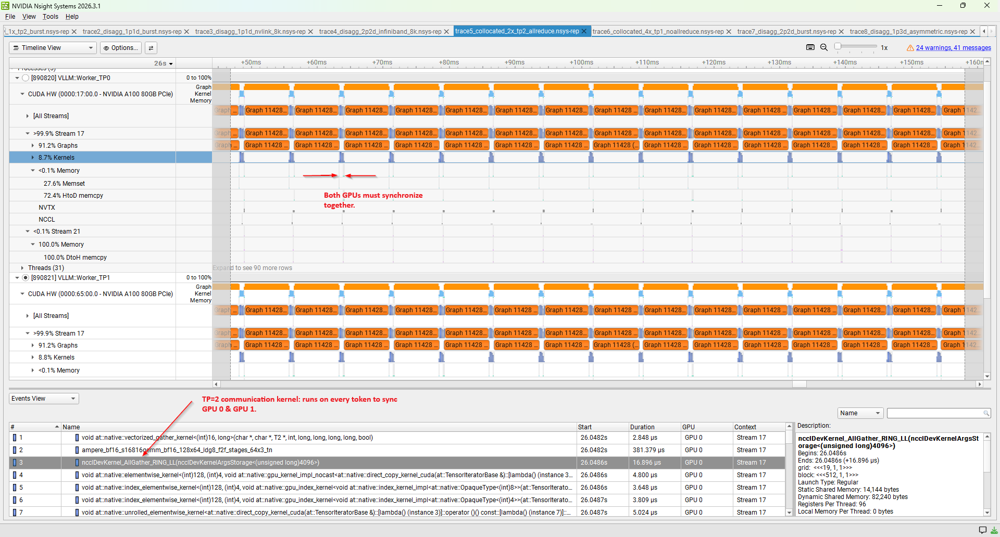
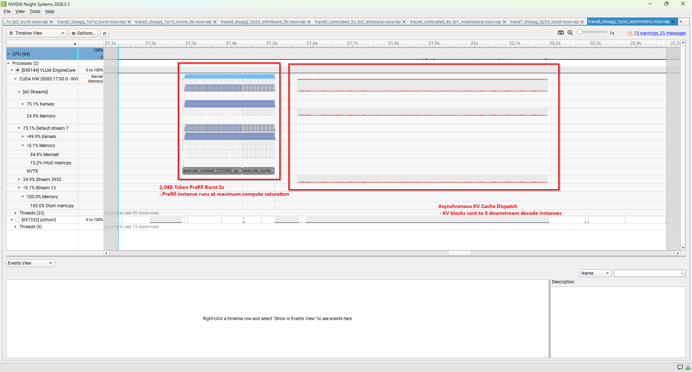
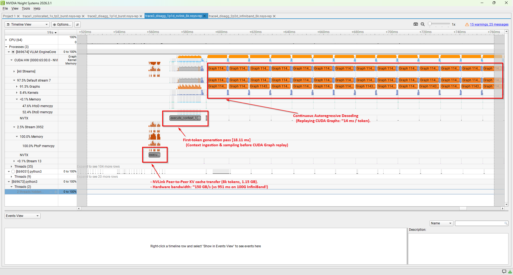
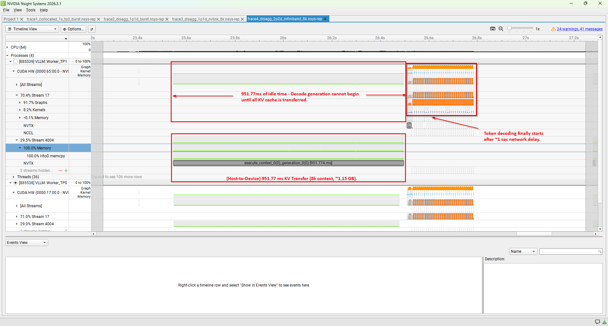

# vLLM Prefill-Decode (P/D) Disaggregation Benchmark

Benchmarking **Prefill-Decode (P/D) Disaggregated Serving** against **Collocated Serving** using **vLLM V1** on a 4× NVIDIA A100-80GB PCIe cluster.

This repository contains raw logs, 279 benchmark JSON results across 9 topologies and 31 workloads, 8 Nsight Systems hardware traces (`.nsys-rep`), 24 parsed kernel/API summaries, and reproducible launch scripts.

---

## 1. Hardware & Environment

The benchmark runs across two GPU nodes (`a100-04` and `a100-02`):

- **GPUs:** 2× NVIDIA A100-PCIE-80GB per node (GPUs 0 & 1).
- **Intra-Node Interconnect (Within Node):** 2-way NVLink bridge clip between GPUs 0 and 1 (~27.35 GB/s P2P).
- **Inter-Node Interconnect (Between Nodes):** Mellanox ConnectX-6 HDR 100 Gbps InfiniBand (`mlx5_0`).
- **CPU & Memory:** Dual Intel Xeon Gold 6338 (NUMA 0 pinned via `numactl` to eliminate cross-socket jitter).
- **Cluster Layout:** Multi-node setup using 2 GPUs on `a100-04` and 2 GPUs on `a100-02`, enabling direct comparisons between in-node NVLink and cross-node InfiniBand KV transfers.

---

## 2. Upstream Proxy Patch

Upstream vLLM V1's proxy dropped `prompt_token_ids` and leaked HTTP client connections. Apply the fix before running disaggregated workloads:
```bash
git apply patches/vllm_toy_proxy_server.patch
```

---

## 3. Evaluated Cluster Configurations & Benchmarks

Benchmarked 9 cluster configurations to compare collocated baselines directly against disaggregated serving:

- **2-GPU Baselines & Disaggregation:**
  - `collocated_1x_tp2`: Standard collocated serving with Tensor Parallelism = 2 on `a100-04`.
  - `collocated_2x_tp1`: Two independent TP=1 collocated replicas behind a local round-robin proxy.
  - `disagg_1p1d`: 1 Prefill worker + 1 Decode worker on the same node over the NVLink bridge.
  - `disagg_1p1d_ib`: Same 1P:1D split, but placed across two separate nodes (`a100-04` $\to$ `a100-02`) to measure the 100G InfiniBand network tax.

- **3-GPU Asymmetric Setup:**
  - `disagg_1p2d`: 1 Prefill worker feeding 2 Decode workers across InfiniBand to balance prefill vs. decode capacity.

- **4-GPU Scaled Deployments:**
  - `collocated_4x_tp1`: Four independent TP=1 collocated instances across both nodes with a proxy.
  - `collocated_2x_tp2`: Two TP=2 collocated instances (one per node).
  - `disagg_1p3d`: 1 Prefill worker feeding 3 Decode workers across NVLink and InfiniBand.
  - `disagg_2p2d`: 2 Prefill workers (TP=2) feeding 2 Decode workers (TP=2) over InfiniBand.

### The Benchmarks

For each of the 9 setups above, executed 31 benchmark suites (279 benchmark runs total) to evaluate performance across real-world serving patterns:

- **Decode-Heavy:** Short prompt, long generation (256 in / 1024 out) at 1, 4, 16, 32, and 64 concurrency.
- **Balanced Chat:** Typical dialogue (1024 in / 512 out) at 1, 4, 16, and 32 concurrency.
- **Enterprise RAG:** Long prompt, short answer (8192 in / 128 out) at 1, 4, 8, and 16 concurrency.
- **Context Length Sweep:** Pushing input length from 512 up to 16,384 tokens to measure KV cache transfer overhead.
- **Injected Burst:** Blasting an 8K prefill storm into the engine while an interactive stream is actively decoding, measuring how bad the stutter (tail latency) gets.
- **Poisson Arrival Sweeps:** Realistic random incoming traffic at different request rates (from light traffic up to server saturation).

*(At peak concurrency, workload memory reached at most ~36% of GPU KV cache capacity on Qwen3-8B, ensuring zero cache evictions or request drops).*

---

## 4. Key Results

### 1. Eliminating Tail-Latency Spikes (Enterprise RAG: 8192 in / 128 out, C=16)

Under heavy concurrent prefill load, collocated serving pauses active token generation to process incoming prompts. Disaggregation isolates the two stages so decode stays steady.

| Metric | Collocated (1x TP=2) | Disaggregated (2P:2D) | Notes |
| :--- | :--- | :--- | :--- |
| Mean TTFT | 682 ms | 2,042 ms | Disagg queues prefill requests |
| P99 TTFT | 3,739 ms | 12,727 ms | Queue builds up under high concurrency |
| Mean TPOT | 23.3 ms | 12.5 ms | Disagg decodes ~1.9× faster |
| **P99 ITL (Jitter)** | **131.8 ms** | **20.2 ms** | **6.5× lower tail latency** |

In the collocated setup, P99 inter-token latency spikes to 131.8 ms whenever new 8k prompts arrive because the GPU prioritizes prefill compute. With 2P:2D, decoding runs on separate GPUs and stays flat at 20.2 ms.

Nsight Systems kernel profiling explains the hardware reason for this tail spike:

| Kernel Category | Collocated (1x TP=2 under burst) | Disaggregated (1P:1D decoder) |
| :--- | :--- | :--- |
| **Prefill GEMMs** (`s16816gemm`) | **63.7%** | **0.0%** |
| **Decode GEMVs** (`s16816gemm_64x64`) | — | **75.2%** |
| **Attention** (FlashAttention / SplitKV) | 6.8% | 0.5% |
| **SoftMax & Sampling** | 11.5% | 16.4% |
| **NCCL AllReduce / AllGather** | 7.9% (6.4% AllReduce + 1.5% AllGather) | 0.0% |
| **Other (Norm, Elementwise)** | 10.1% | 7.9% |

In collocated serving under burst, heavy prefill GEMMs monopolize 63.7% of GPU execution time, stalling active decode steps. Under disaggregated serving, the decode GPU registers 0.0% prefill kernels and devotes 75.2% of compute cycles to steady decode GEMVs:

| Collocated 1x TP=2: Prefill GEMM Saturation (Trace 1) | Disaggregated 1P:1D: Dedicated Decode Cadence (Trace 2) |
| :---: | :---: |
|  |  |
| *Large prefill GEMM chunks block decode iterations* | *Flat, uninterrupted token emission (75.2% decode GEMV)* |

---

### 2. Single-Stream Decode Latency (256 in / 1024 out, C=1)

For a single user stream, a 1P:1D disaggregated setup decodes slower than a collocated TP=2 setup:

| Metric | Collocated (1x TP=2) | Disaggregated (1P:1D) |
| :--- | :--- | :--- |
| Output Throughput | 131.7 tok/s | 85.6 tok/s |
| **Time Per Token (TPOT)** | **7.6 ms** | **11.6 ms** |
| Memory Bus Width | 2× A100 (~4.08 TB/s) | 1× A100 (~2.04 TB/s) |

Because single-token autoregressive decoding is memory-bandwidth bound, sharding the model weights across two GPUs in TP=2 gives 4.08 TB/s of aggregate memory bandwidth. In 1P:1D, decoding runs on a single GPU with only 2.04 TB/s. To match or exceed TP=2 decode speed, disaggregated deployments need asymmetric decoders (1P:2D, 1P:3D) or TP=2 decoders (2P:2D).

However, TP=2 introduces communication overhead: 72 NCCL synchronization barriers per token across transformer layers, consuming 3.2% of kernel runtime in `ncclDevKernel_AllGather_RING_LL`. Disaggregated asymmetric pooling (1P:3D) balances compute and memory by having 1 prefill engine feed 3 independent TP=1 decoders without any NCCL barrier penalty:

| Collocated TP=2: NCCL Communication Barriers (Trace 5) | Disaggregated 1P:3D: Asymmetric Decode Multiplexing (Trace 8) |
| :---: | :---: |
|  |  |
| *72 NCCL barriers per token (`ncclDevKernel_AllGather_RING_LL`) consuming 3.2% GPU time* | *1 Prefill instance feeding 3 Decoders, balancing FLOP-heavy and memory-bound stages* |

---

### 3. Interconnect Overhead: NVLink vs. 100G InfiniBand (16k Context Sweep)

Transferring a 16,384-token KV cache (~2.36 GB) highlights the difference between local NVLink and cross-node network transfers:

| Setup | Interconnect | Mean TTFT |
| :--- | :--- | :--- |
| Disagg 1P:1D | NVLink Bridge (~27.35 GB/s) | 1,538 ms |
| Disagg 1P:1D IB | 100G InfiniBand (~11.5 GB/s) | 3,303 ms |

Transferring the cache over 100G InfiniBand adds 1,765 ms to TTFT compared to the NVLink bridge. For large context windows (>8k tokens), co-locating prefill and decode instances on the same host over NVLink avoids this network transfer delay.

Nsight Systems traces capture the physical transfer mechanisms: NVLink maps remote memory via zero-copy IPC in 5.79 ms, whereas cross-node InfiniBand spends 48.5% of CUDA runtime in `cuStreamSynchronize` waiting for UCX RDMA transfers:

| NVLink 1P:1D: Zero-Copy IPC Handshake (Trace 3) | 100G InfiniBand 2P:2D: Driver Synchronization Stall (Trace 4) |
| :---: | :---: |
|  |  |
| *`cuIpcOpenMemHandle_v2` completes in 5.79 ms with fast DMA* | *48.5% CUDA API runtime stalled in `cuStreamSynchronize` waiting for UCX RDMA* |

---

## 5. Quick Start & Execution

Apply the proxy patch and launch any topology (e.g. Disaggregated 1P:1D):

```bash
# 1. Apply upstream fix
git apply patches/vllm_toy_proxy_server.patch

# 2. Launch engine (Terminal 1)
bash scripts/launch_disagg_1p1d.sh Qwen/Qwen3-8B

# 3. Run benchmarks (Terminal 2)
bash scripts/run_benchmarks.sh disagg_1p1d 8000 Qwen/Qwen3-8B
```

*(See [`commands.md`](commands.md) for launch and teardown scripts across all other 8 topologies).*

---

## 6. Artifact Verification & Parsing

To audit all 279 benchmark JSON files, 8 Nsight traces, 24 CSV summaries, and 9 launch scripts:

```bash
python scripts/verify_all_artifacts.py
```

To generate Markdown comparison tables between any collocated and disaggregated topology pair:

```bash
python scripts/parse_results.py --collocated results/collocated_1x_tp2 --disaggregated results/disagg_2p2d
```

---

## 7. Repository Layout

```text
├── patches/       # Upstream vLLM V1 proxy bugfix
├── scripts/       # Launchers (9 topologies), benchmark runner, nsys capture, and verification
├── results/       # 279 raw benchmark JSONs (9 topologies x 31 workloads)
│   └── traces/    # 8 Nsight Systems traces (.nsys-rep) and 24 parsed CSV reports
├── docs/          # Hardware and cluster environment specifications
└── commands.md    # Complete copy-paste execution runbook
```

